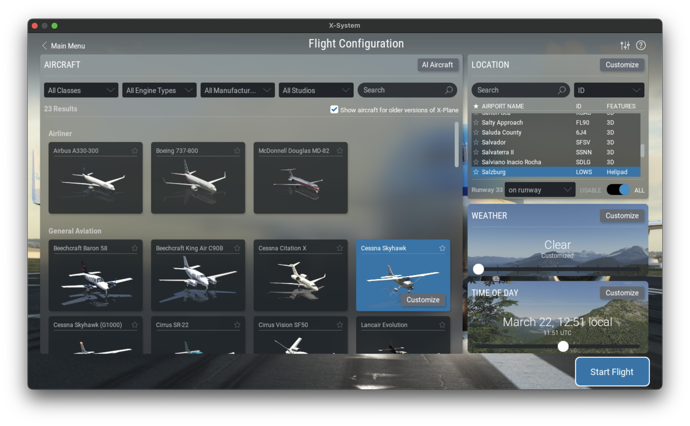
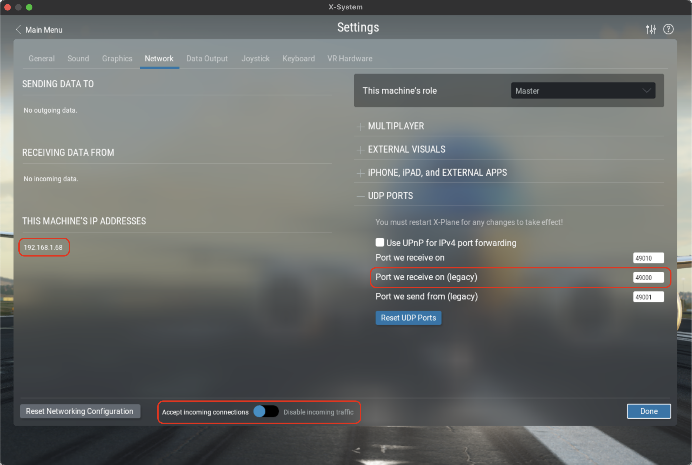
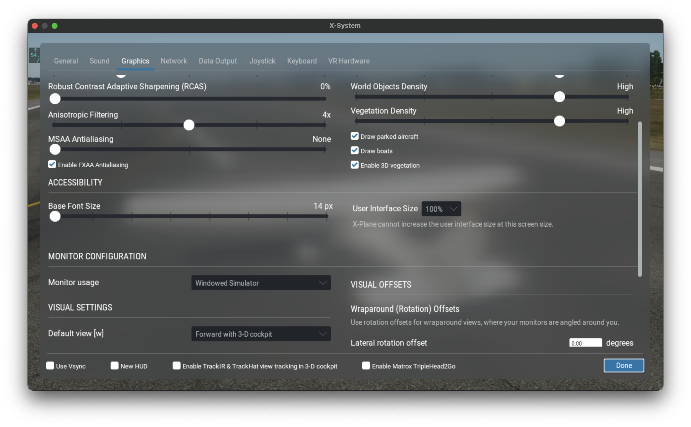
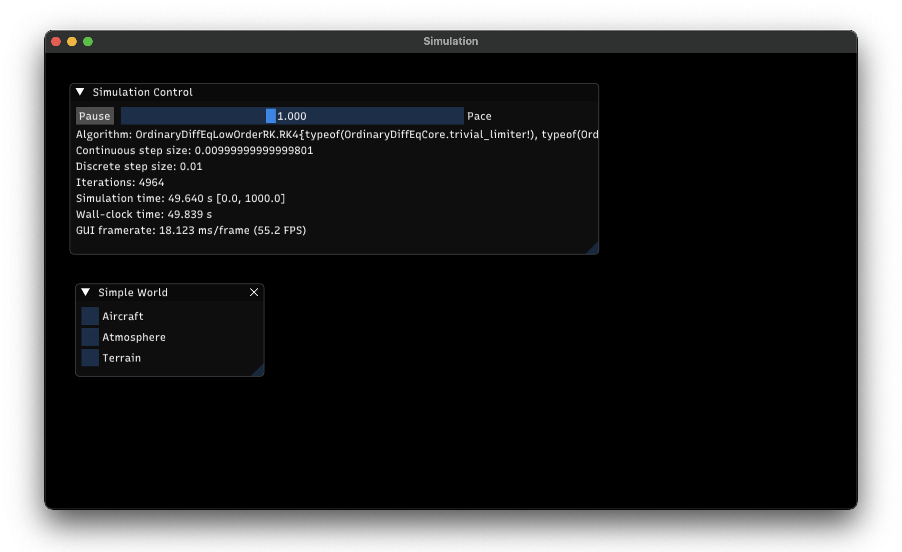

# Interactive Simulation

This example shows how to set up and run an interactive aircraft simulation. You will be able to
control it through the built-in GUI and, optionally, use the free X-Plane 12 demo for 3D
visualization.

### Setting Up X-Plane 12

Download, install and run the [X-Plane 12 demo](https://www.x-plane.com/desktop/try-it/). If you
happen to have the full version, you can use it instead. Since we will be using X-Plane simply as an
external visualization tool, we only need to set up a few things; for further help, check out the
[X-Plane 12 manual](https://www.x-plane.com/manuals/desktop/).

!!! note "Without X-Plane"

    If you can't run X-Plane 12 (which might happen for instance if you have an Intel integrated
    graphics chip), you can skip this section. Your visuals will be limited to the built-in GUI, but
    everything else should still work.

From the main menu, click on *New Flight*. Select the Cessna Skyhawk as your aircraft and Salzburg
(LOWS) as your initial location. Start the flight.



To switch to an external camera, press Shift+4. Right click and drag to rotate the view and
use the mouse wheel to zoom in and out. To return to the cockpit camera, press Shift+0.


Move the mouse to the top of the screen to bring up the menu bar. Click on the *Settings* icon and
go the *Network* tab. Make sure *Accept incoming connections* is enabled. Then, under the *UDP
Ports* section, check the *Port we receive on (legacy)* value. The default is 49000, but you can use
a different one if you need to. Finally, if you are running X-Plane on a different machine than your
Julia session, note its IP address.



Now go to the *Graphics* tab. Unless you have a multi-monitor setup, you will probably want to run
X-Plane in windowed mode. This will allow you to keep it on screen along with the ```Flight.jl```
built-in GUI. To enable windowed mode, select *Windowed Simulator* in the *Monitor usage* drop-down.



You might also want to experiment with the quality settings until you achieve a comfortable
framerate. To display the framerate on screen, go to the *Data Output* tab, find the *Framerate*
entry in the table and enable the *Show in cockpit* option.


This concludes our X-Plane setup, now let's move on to Julia.


### Setting Up the ```Flight.jl``` Simulation

!!! warning "Configuring Julia for Multithreading"

    When running an interactive simulation, ```Flight.jl``` uses multithreading to concurrently handle
    the simulation loop, the built-in GUI and any attached I/O devices. Therefore, to work through this
    example you will need to start Julia with multiple threads enabled. You can find out how to do this in
    the [manual](https://docs.julialang.org/en/v1/manual/multi-threading/). However, if you are using the
    Julia extension for VS Code, the easiest way is to add the following entry to your
    ```settings.json```:

    ```json
    "julia.additionalArgs": [
        "--threads=auto",
    ],
    ```

    This should work well for most modern CPUs. If you have issues running the
    simulation, try setting the number of threads manually to 4 or higher:

    ```json
    "julia.additionalArgs": [
        "--threads=4",
    ],
    ```

Let's begin by initializing the package:
```@example ex01
using Flight
```

Next, we need to define a 2D location and orthometric elevation for the beginning of Salzburg airport's
runway 15, as well as the runway's geographic heading:
```@example ex01
loc_LOWS15 = LatLon(ϕ = deg2rad(47.80433), λ = deg2rad(12.997))
h_LOWS15 = HOrth(427.2)
ψ_LOWS15 = deg2rad(157)
nothing # hide
```

!!! note "Keeping Appearances"

    These values will result in X-Plane displaying the aircraft properly positioned and aligned
    on the runway centerline at the beginning of the simulation. However, this is just for aesthetics,
    since our simulation's physics are totally independent from X-Plane's terrain mesh. This disconnect will
    become apparent as soon as the aircraft starts rolling down the runway.

Our simulated world will consist of an aircraft, an atmospheric model and a terrain model:

```@example ex01
aircraft = Cessna172Xv1()
atmosphere = SimpleAtmosphere()
terrain = HorizontalTerrain(altitude = h_LOWS15)
world = SimpleWorld(aircraft, atmosphere, terrain)
nothing # hide
```

The ```Cessna172Xv1``` aircraft is a hypothetical customization of a Cessna 172S. It replaces the
reversible actuation system on the base model with a digital fly-by-wire flight control system,
which we will leverage in this example. Note that this aircraft does not aim to replicate the
internals or interface of any specific real-world autopilot. Its main purpose is simply to
illustrate how the ```Flight.jl``` framework can be used to design, implement and test complex
control architectures.

```SimpleAtmosphere``` provides a basic,
[ISA](https://en.wikipedia.org/wiki/International_Standard_Atmosphere)-based atmospheric model with
customizable sea-level conditions and wind velocity. ```HorizontalTerrain``` is a terrain model with
constant orthometric elevation, which we have set to our previous value for the beginning of runway
15\.

Now we can create our simulation with a suitable integration step size:
```@example ex01
sim = Simulation(world; dt = 0.01)
nothing # hide
```

Under the hood, the call to the ```Simulation``` constructor will use our ```SimpleWorld```
instance as a blueprint for constructing a runnable ```System```, which is what will actually get
simulated.

Next, we instantiate an X-Plane 12 control interface and attach it to the simulation. This will
allow the simulation to disable X-Plane's physics engine and periodically send our aircraft's state
for X-Plane to display:
```@example ex01
xp = XPlane12Control()
Sim.attach!(sim, xp)
nothing # hide
```

!!! note "X-Plane UDP Settings"

    The default ```XPlane12Control``` constructor assumes X-Plane 12 is running on your local machine
    and listening on port 49000. If this is not the case, you will need to provide the appropriate IP
    address and/or port (discussed in the X-Plane setup section) as keyword arguments. For example:

    ```@example
    using Flight # hide
    using Sockets #bring IPv4 into scope
    xp = XPlane12Control(address = IPv4("192.168.1.2"), port = 49001)
    nothing # hide
    ```

```Flight.jl``` provides basic joystick support via [SDL2_jll]
(https://github.com/JuliaBinaryWrappers/SDL2_jll.jl). Currently, Thrustmaster's T.16000M is the only
implemented model. Adding support for other joysticks should be relatively straightforward, but we
will not get into it here. If you happen to have a T.16000M available, you can plug it in now and do
the following:

```@example ex01
for joystick in update_connected_joysticks()
    isa(joystick, Joysticks.T16000M) && Sim.attach!(sim, joystick)
end
```

Otherwise, don't worry; in this example, you can let the SAS and autopilot modes handle the flying
for you, which makes it easy to control the aircraft through the GUI.

The last step is to define a suitable initial condition. For on-ground initialization, we can do
that by specifying the aircraft's frame kinematic state:

```@example ex01
init_gnd = KinInit(;
    loc = loc_LOWS15, #2D location
    h = h_LOWS15 + C172.Δh_to_gnd, #altitude, as an offset with respect to terrain elevation
    q_nb = REuler(ψ_LOWS15, 0, 0), #attitude with respect to NED frame, as Euler angles
    ω_wb_b = zeros(3), #angular velocity with respect to local tangent frame, aircraft frame coordinates
    v_eb_n = zeros(3), #Earth-relative velocity, NED frame coordinates
    )
nothing # hide
```

And then we assign it as:
```@example ex01
Sim.init!(sim, init_gnd)
```

### Running the Simulation

Now we can finally run the simulation as follows:
```julia
Sim.run_interactive!(sim)
```

After a few seconds, the simulation will launch and a new OS window containing the built-in GUI will
open:



The first window is the simulation control panel, which lets you pause the simulation and set its
pace relative to wall clock time. The second one is specific to the simulated ```System```.

A complex ```System``` (like ours) comprises a hierarchy of components. Each component is itself a
```System``` and typically defines its own GUI window, which can be accessed from that of its
parent. Feel free to explore the GUI to get a picture of the underlying component hierarchy and
discover different ways of interacting with the simulation.

To abort the simulation, simply close the GUI's OS window.

!!! tip "GUI State"

    GUI windows can be moved, resized or docked as desired. GUI state is saved in a file named
    **imgui.ini**, which is automatically created in the project's root folder.  Deleting this file
    will restore the GUI to its default state.

Let's get back to X-Plane for a moment. You should now see the aircraft sitting on the runway *with
the engine stopped*. This indicates that the X-Plane interface was set up properly and the simulation
has taken control of the visuals.


!!! note "X-Plane 12 Demo Time Limit"

    The X-Plane 12 demo is time-limited to 15 minutes. After that, an on-screen pop-up will appear. To
    get rid of it, you can restart X-Plane and click on *Resume Last Flight*. You will then need to
    abort the simulation, reset it and run it again:

    ```julia
    Sim.init!(sim, init_gnd)
    Sim.run_interactive!(sim)
    ```

Now, open the *Aircraft > Avionics > Flight Control* window. Expand the *Engine* section

REPLACE SCREENSHOT

**TODO: Maybe add on-air initialization**

**TODO: Installation notes on dedicated section. Mention Revise**