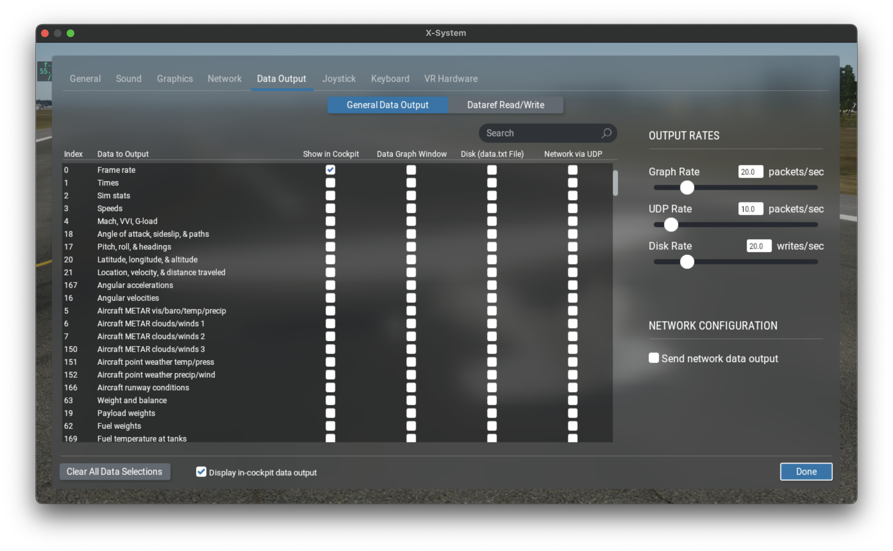

# Interactive Simulation

This example shows how to set up and run an interactive aircraft simulation. You will be able to
control it through the built-in GUI and, optionally, use the free X-Plane 12 demo for 3D
visualization.

!!! warning "Configuring Julia for Multithreading"

    When running an interactive simulation, ```Flight.jl``` uses multithreading to concurrently handle
    the simulation loop, the built-in GUI and any attached I/O devices. Therefore, to work through this
    example you will need to start Julia with multiple threads enabled. You can find out how to do this in
    the [manual](https://docs.julialang.org/en/v1/manual/multi-threading/). However, if you are using the
    Julia extension for VS Code, the easiest way is to add the following entry to your
    ```settings.json``` (the ```auto``` setting will work well for most modern CPUs):

    ```json
    "julia.additionalArgs": [
        "--threads=auto",
    ],
    ```

### Setting Up X-Plane 12

Download, install and run the [X-Plane 12 demo](https://www.x-plane.com/desktop/try-it/). If you
happen to have the full version, you can use it instead. Since we will be using X-Plane simply as an
external visualization tool, we only need to set up a few things; for further help, check out the
[X-Plane 12 manual](https://www.x-plane.com/manuals/desktop/).

!!! note

    If you can't run X-Plane 12 (which might happen for instance if you have an Intel integrated
    graphics chip), you can skip this section. Your visuals will be limited to the built-in GUI, but
    everything else should still work.

From the main menu, click on *New Flight*. Select the Cessna Skyhawk as your aircraft and Salzburg
(LOWS) as your initial location. Start the flight.


To switch to an external camera, press Shift+4. Right click and drag to rotate the view and
use the mouse wheel to zoom in and out. To return to the cockpit camera, press Shift+0.


Move the mouse to the top of the screen to bring up the menu bar. Click on the *Settings* icon and
go the *Network* tab. Make sure *Accept incoming connections* is enabled. Then, under the *UDP
Ports* section, check the *Port we receive on (legacy)* value. The default is 49000, but you can use
a different one if you need to. Finally, if you are running X-Plane on a different machine than your
Julia session, note its IP address.


Now go to the *Graphics* tab. Unless you have a multi-monitor setup, you will probably want to run
X-Plane in windowed mode. This will allow you to keep it on screen along with the ```Flight.jl```
built-in GUI. To enable windowed mode, select *Windowed Simulator* in the *Monitor usage* drop-down.


You might also want to experiment with the quality settings until you achieve a comfortable
framerate. To display the framerate on screen, go to the *Data Output* tab, find the *Framerate*
entry in the table and enable the *Show in cockpit* option.



This concludes our X-Plane setup, now let's move on to Julia.


### Setting Up the ```Flight.jl``` Simulation

First, let's initialize the package:
```@example ex01
using Flight
```

Next, we define a 2D location and orthometric elevation for the beginning of Salzburg airport's
runway 15, as well as the runway's geographic heading:
```@example ex01
loc_LOWS15 = LatLon(ϕ = deg2rad(47.80433), λ = deg2rad(12.997))
h_LOWS15 = HOrth(427.2)
ψ_LOWS15 = deg2rad(157)
nothing # hide
```

!!! note

    These values will result in X-Plane displaying the aircraft properly positioned and aligned
    on the runway centerline at the beginning of the simulation. However, this is just for appearance,
    since our simulation's physics are totally independent from X-Plane's terrain mesh. This disconnect will
    become apparent as soon as the aircraft starts rolling down the runway.

Our simulated world will consist of an aircraft, an atmospheric model and a terrain model:

```@example ex01
aircraft = Cessna172Xv1()
atmosphere = SimpleAtmosphere()
terrain = HorizontalTerrain(altitude = h_LOWS15)
world = SimpleWorld(aircraft, atmosphere, terrain)
nothing # hide
```

The ```Cessna172Xv1``` aircraft is a hypothetical customization of a Cessna 172S. It replaces the
reversible actuation system on the base model with a digital fly-by-wire flight control system,
which we will leverage in this example. Note that this aircraft does not aim to replicate the
internals or interface of any specific real-world autopilot. Its main purpose is simply to
illustrate how the ```Flight.jl``` framework can be used to design, implement and test complex
control architectures.

```SimpleAtmosphere``` provides a basic,
[ISA](https://en.wikipedia.org/wiki/International_Standard_Atmosphere)-based atmospheric model with
customizable sea-level conditions and wind velocity. ```HorizontalTerrain``` is a terrain model with
constant orthometric elevation, which we have set to our previous value for the beginning of runway
15\.

Now we can create our simulation, specifying a suitable integration step size:
```@example ex01
sim = Simulation(world; dt = 0.01)
nothing # hide
```

Next, we instantiate an X-Plane 12 control interface and attach it to the simulation. This will
allow the simulation to disable X-Plane's physics engine and periodically send our aircraft's state
for X-Plane to display:
```@example ex01
xp = XPlane12Control()
Sim.attach!(sim, xp)
nothing # hide
```

!!! note "X-Plane UDP Settings"

    The default ```XPlane12Control``` constructor assumes X-Plane 12 is running on your local machine
    and listening on port 49000. If this is not the case, you will need to provide the appropriate IP address and/or
    port, discussed during X-Plane setup, as keyword arguments. For example:

    ```@example
    using Flight # hide
    using Sockets #bring IPv4 into scope
    xp = XPlane12Control(address = IPv4("192.168.1.2"), port = 49001)
    nothing # hide
    ```

The ```Flight.jl``` framework provides a joystick interface layer via [SDL2_jll]
(https://github.com/JuliaBinaryWrappers/SDL2_jll.jl). Currently, Thrustmaster's T.16000M is the only
implemented model. Adding support for other joysticks is relatively straightforward, but we will not
get into it in this example. If you happen to have a T.16000M available, you can plug it in now and
do the following:

**TODO**

Otherwise, don't worry. In this example, the SAS and autopilot modes will do most of the flying for
us, so you can control the aircraft through the GUI.

The last step before running the simulation is to define and assign a suitable initial condition.
For on-ground initialization, we can do that by specifying the aircraft frame's initial kinematic
state as follows:

!!! note "Demo Time Limit"

    The X-Plane 12 demo is time-limited to 15 minutes. After that, an on-screen pop-up will appear. To
    get rid of it, you can restart X-Plane and click on *Resume Last Flight*. You will then need to
    abort the Julia simulation and run it again (we will see how to do this shortly).


**TODO: Maybe add on-air initialization**
**TODO: Installation notes on dedicated documentation section. Mention Revise**