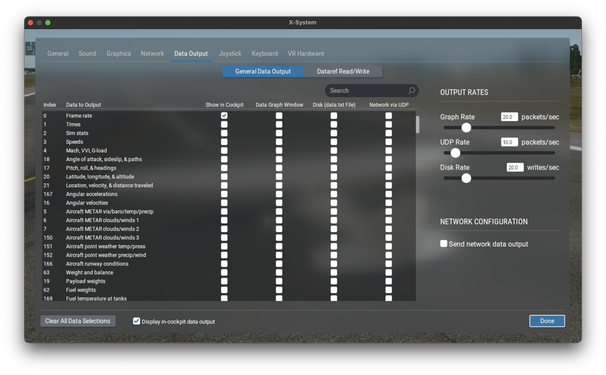
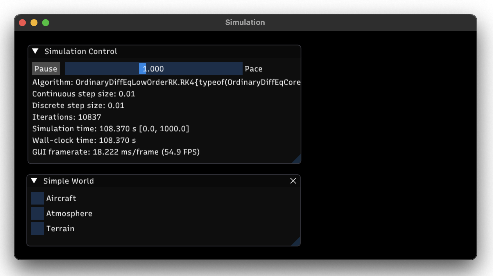
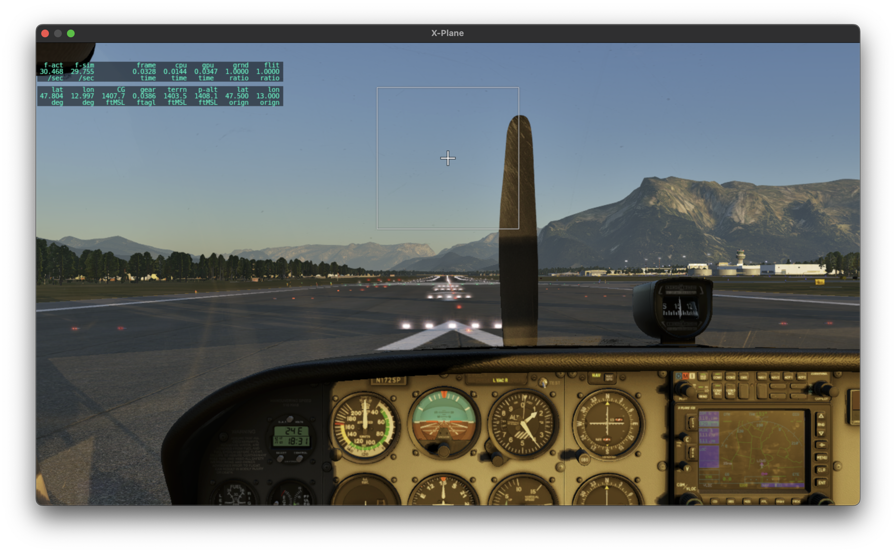
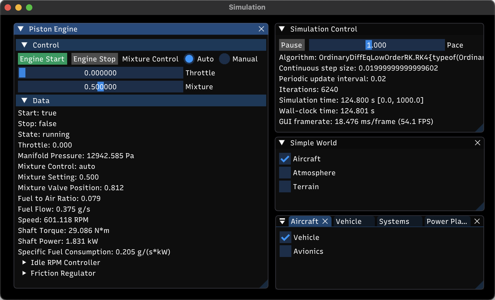
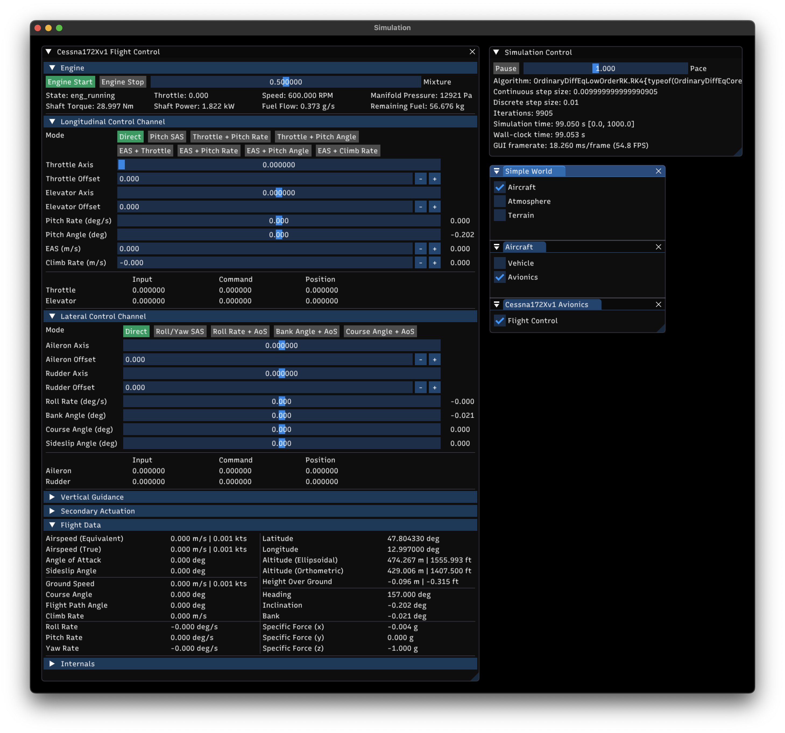

# Interactive Simulation

This tutorial shows how to set up and run an interactive aircraft simulation. You will be able to
control it through the built-in GUI and, optionally, use the free X-Plane 12 demo for 3D
visualization.

### Setting Up X-Plane 12

Download, install and run the [X-Plane 12 demo](https://www.x-plane.com/desktop/try-it/). If you
happen to have the full version, you can use it instead. Since we will be running X-Plane simply as
an external visualization tool, we only need to set up a few things; for further help, check out the
[X-Plane 12 manual](https://www.x-plane.com/manuals/desktop/).

!!! note "No X-Plane?"

    If you can't run X-Plane 12 (which might happen for instance if you have an Intel integrated
    graphics chip), you can skip this section. Your visuals will be limited to the built-in GUI, but
    everything else should still work.

From the main menu, click on *New Flight*. Select the Cessna Skyhawk as your aircraft and Salzburg
(LOWS) as your initial location. Start the flight.


Once X-Plane is done loading, move the mouse to the top of the screen to bring up the menu bar.
Click on the *Settings* icon and go the *Network* tab. Make sure *Accept incoming connections* is
enabled. Then, under the *UDP Ports* section, check the *Port we receive on (legacy)* value. The
default is 49000, but you can use a different one if you need to. Finally, if you are running
X-Plane on a different machine than your Julia session, note its IP address.


Now go to the *Graphics* tab. Unless you have a multi-monitor setup, you will probably want to run
X-Plane in windowed mode. This will allow you to keep it on screen along with the ```Flight.jl```
built-in GUI. To enable windowed mode, select *Windowed Simulator* in the *Monitor usage* drop-down.


You might also want to experiment with the quality settings until you achieve a comfortable
framerate. To display the framerate on screen, go to the *Data Output* tab, find the *Framerate*
entry in the table and enable the *Show in cockpit* option.



To switch to an external camera, press Shift+4. You can right click and drag to rotate the view and
use the mouse wheel to zoom in and out. To return to the cockpit camera, press Shift+0.


This concludes our X-Plane setup, now let's move on to Julia.


### Setting Up the ```Flight.jl``` Simulation

!!! warning "On Multithreading"

    To work through this example, you will need to start Julia with [multiple threads enabled](@ref "Installation").

Let's begin by initializing the package:
```@example tutorial01
using Flight
```

Next, we need to define a 2D location and orthometric elevation for the beginning of Salzburg airport's
runway 15, as well as the runway's geographic heading:
```@example tutorial01
loc_LOWS15 = LatLon(ϕ = deg2rad(47.80433), λ = deg2rad(12.997))
h_LOWS15 = HOrth(427.2)
ψ_LOWS15 = deg2rad(157)
nothing # hide
```

!!! note "A Caveat On X-Plane Visuals"

    The above values will result in X-Plane displaying the aircraft properly positioned and aligned
    on the runway centerline at the beginning of the simulation. However, this is just for aesthetics,
    since our simulation's physics are totally independent from X-Plane's terrain mesh. This disconnect will
    become apparent as soon as the aircraft starts rolling down the runway.

Now, let's create our simulated world:

```@example tutorial01
aircraft = Cessna172Xv1()
atmosphere = SimpleAtmosphere()
terrain = HorizontalTerrain(h_LOWS15)
world = SimpleWorld(aircraft, atmosphere, terrain)
nothing # hide
```

 ```SimpleAtmosphere``` provides a basic,
[ISA](https://en.wikipedia.org/wiki/International_Standard_Atmosphere)-based atmosphere with
customizable sea-level conditions and wind velocity. ```HorizontalTerrain``` represents a surface
with constant orthometric elevation, which we have set to our value for the beginning of runway 15.
Finally, ```Cessna172Xv1``` is a hypothetical customization of a Cessna 172S. It replaces the
reversible actuation system on the base model with a digital fly-by-wire flight control system,
which we will leverage in this example. Note that this aircraft does not aim to replicate the
internals or interface of any specific real-world autopilot. Its purpose is simply to illustrate how
the ```Flight.jl``` framework may be used to design, implement and test complex control
architectures\.

We can now build our simulation:
```@example tutorial01
sim = Simulation(world; dt = 0.01) #specifies a suitable integration step size
nothing # hide
```

Under the hood, this call turns our ```SimpleWorld``` instance into a ```Model``` object, which is
what the ```Simulation``` will actually interact with. The ```Model``` type is central to the
```Flight.jl``` framework, and we will look into it further in future examples.

Next, we instantiate an X-Plane 12 control interface and attach it to the simulation. This will
allow the simulation to disable X-Plane's physics engine and periodically send our aircraft's state
for X-Plane to display:
```@example tutorial01
xp = XPlane12Control()
Sim.attach!(sim, xp)
nothing # hide
```

!!! note "X-Plane UDP Settings"

    The default ```XPlane12Control``` constructor assumes X-Plane 12 is running on your local machine
    and listening on port 49000. If this is not the case, you will need to provide the appropriate IP
    address and/or port (discussed in the X-Plane setup section) as keyword arguments. For example:

    ```@example
    using Flight # hide
    using Sockets #bring IPv4 into scope
    xp = XPlane12Control(address = IPv4("192.168.1.2"), port = 49001)
    nothing # hide
    ```

```Flight.jl``` provides a generic joystick interface built on [SDL2_jll]
(https://github.com/JuliaBinaryWrappers/SDL2_jll.jl). Currently, Thrustmaster's
[T.16000M](https://www.thrustmaster.com/products/t-16000m-fcs/) and VKBSim's [Gladiator NXT
Evo](https://flightsimcontrols.com/product/gladiator-evo-space-combat-edition/) are the only
supported models. If you happen to own one of these, you can plug it in now and do the following:

```@example tutorial01
for joystick in update_connected_joysticks()
    Sim.attach!(sim, joystick)
end
```

Otherwise, don't worry; in this example, we will let the SAS and autopilot modes handle most of
the flying for us. This will make it relatively easy to control the aircraft through the GUI.

The last step is to define a suitable initial condition. For on-ground initialization, we can do
that by specifying the aircraft's frame kinematic state:

```@example tutorial01
init_gnd = KinInit(;
    location = loc_LOWS15, #2D location
    h = h_LOWS15 + C172.Δh_to_gnd, #altitude, as an offset with respect to terrain elevation
    q_nb = REuler(ψ_LOWS15, 0, 0), #attitude with respect to NED frame, as Euler angles
    ω_wb_b = zeros(3), #angular velocity with respect to local tangent frame, aircraft frame coordinates
    v_eb_n = zeros(3), #Earth-relative velocity, NED frame coordinates
    ) |> C172.Init
nothing # hide
```

Then, we assign it as:
```@example tutorial01
init!(sim, init_gnd)
```

### Running the Simulation

Now we can finally run the simulation:
```julia
Sim.run!(sim; gui = true)
```

After a few seconds, the simulation will start, and a new OS window containing the built-in GUI
will open:



The *Simulation Control* panel lets you pause or resume the simulation, and set its pace relative to
wall clock time. To abort the simulation, simply close the GUI window.

The other panel is specific to the simulated ```Model```. A complex ```Model``` like ours
comprises a hierarchy of components. Each component is itself a ```Model```, and it typically
defines its own GUI panel, which can be accessed from that of its parent. Feel free to explore the
GUI to get a picture of the underlying component hierarchy and discover different ways of
interacting with the simulation.

!!! tip "GUI State"

    GUI panels can be moved, resized, tiled, docked or grouped as tabs. Try to find the layout that works
    best for you. GUI state is saved in a file named **imgui.ini**, which is automatically created in
    the project's root folder.  Deleting this file will restore the GUI to its default state.

Let's get back to X-Plane for a moment. You should now see the aircraft sitting on the runway *with
the engine stopped*. This indicates that the X-Plane interface was set up properly and our
simulation has taken control of the visuals.



!!! note "X-Plane 12 Demo Time Limit"

    As of this writing, the X-Plane 12 demo is time-limited to 60 minutes. After that, an on-screen
    pop-up will appear. To get rid of it, you can simply restart X-Plane and click on *Resume Last
    Flight*. Then, reset the simulation and run it again:

    ```julia
    init!(sim, init_gnd)
    Sim.run!(sim; gui = true)
    ```

Now return to the GUI and navigate to *Aircraft > Vehicle > Systems > Power Plant > Engine*. Expand
the *Control* header and press the *Engine Start* button. To confirm the engine is running, you can
check the engine parameters under the *Data* header.



If you now try to drag the *Throttle* slider, you will notice it does not move. The reason is that,
on this aircraft, throttle is controlled through the fly-by-wire flight control system.

You can find the flight control system's interface under *Aircraft > Avionics*. Expand its
*Longitudinal Control* and *Lateral Control* sections. The longitudinal control channel computes
throttle and elevator commands. The lateral control channel computes aileron and rudder commands.
Both are initialized in *Direct* mode, wherein each actuator command is simply the sum of its
corresponding *Axis* and *Offset* values. With *Direct* mode active on both channels, you are
essentially flying the base Cessna 172S model, except for the additional actuator dynamics.

Try moving the control surfaces using the *Axis* and *Offset* inputs, and observe the result on the
GUI's numerical displays or an external X-Plane camera. When you are done, reset all values back to
zero.

!!! note "Joystick Override"

    If you have a joystick attached, the *Axis* sliders will be overridden
    by the corresponding joystick axes.

!!! tip "Keyboard Input"

    To assign a precise value to a control slider, use Ctrl+Click (on Windows)
    or Cmd+click (on Mac) to enable keyboard input.

Under *Longitudinal Control*, select the *SAS* mode. In this mode, throttle and elevator inputs are
fed to a longitudinal stability compensator, which computes the actual throttle and elevator
actuator commands. This modifies the natural short-period and phugoid modes, providing a smoother,
more stable pitch response. When clicked, the button will turn amber, indicating the mode is now on
standby; it will engage automatically upon lift off.

Under *Lateral Control*, select the *SAS* mode. In this mode, aileron and rudder inputs are fed to a
lateral stability compensator, which computes the actual aileron and rudder actuator commands. This
improves the aircraft's Dutch roll response and stabilizes its naturally unstable spiral mode.

Currently, the GUI does not have a graphical instrument panel. Instead, the *Flight Data* section
provides readouts for all essential variables. This will be particularly useful if you're running
this example without X-Plane.



That is all we really need to set up for take off. We won't bother with flap settings, rotation or
even keeping the aircraft centered on the runway (which, as far as our simulation is concerned,
doesn't really exist!). When you're ready, just set the *Throttle Axis* all the way to 1 and let
the aircraft accelerate and lift off on its own.

Once airborne, you will see the previously selected SAS modes turn from amber to green. Let the
aircraft climb for a while to give yourself some clearance. Then, spend some time flying with the
SAS modes enabled. When you feel comfortable with the controls, try switching back and forth between
the *Direct* and *SAS* longitudinal modes, and compare the aircraft's response to elevator input.
You can do the same with the *Direct* and *SAS* lateral modes to compare aileron and rudder
responses, but mind the spiral mode instability!

!!! tip "Crashing"

    If the landing gear model detects a crash, it will throw an exception and the simulation will
    abort. No worries, just reset it and have another go.

Next, try the *EAS + Pitch Rate* mode. This mode combines an autothrottle loop with a pitch rate
loop built on top of the longitudinal SAS. Activating this mode will disable all *Throttle* and
*Elevator* inputs and enable the *EAS* and *Pitch Rate* commands. The numerical readout to the right
of each command slider shows the current value of its target variable. Try changing the *EAS*
command and observe the response. Then, experiment with the *Pitch Rate* command. While doing so,
keep in mind that an arbitrary pitch rate cannot be sustained indefinitely!

!!! note "Mode Transitions"

    When a new autopilot mode is engaged, its command variables are automatically set to their current
    values to provide a smooth transition. The exception are *Pitch Rate* and *Roll Rate* commands,
    which are always initialized to zero.

When you are done, enable the *EAS + Altitude Hold* mode and set the *EAS* command to 50 m/s. This
will hold your altitude throughout the next steps.

If you have attempted any turns so far, you may have noticed that the *Roll/Yaw SAS* mode does not
provide automatic turn coordination. For this, you can use one of the higher level lateral modes,
all of which track sideslip angle commands. Go ahead and enable the *Bank Angle + Sideslip* mode.
Set the *Sideslip Angle* command to zero. Then, initiate a turn with the *Bank Angle* command, and
notice how the sideslip angle is indeed held during the turn.

Finally, enable the *Course Angle + Sideslip* mode. Set the *Course Angle* to 0 and let the aircraft
turn to intercept it. Then, open the *Atmosphere > Wind* panel. Use the *East* slider to add some
crosswind. Notice how the aircraft turns into the wind, settling on the appropriate heading to
maintain the commanded course angle, while also tracking the commanded sideslip angle.


Feel free to explore the remaining control modes on your own. One final hint before wrapping up: if
the take-off sequence starts getting tedious, you can skip it entirely by using the trim
functionality to initialize the aircraft in flight. Here's how to do it:
```@example tutorial01
init_air = C172.TrimParameters(;
    Ob = Geographic(loc_LOWS15, h_LOWS15 + 500), #500 m above runway 15
    EAS = 50.0, #equivalent airspeed (m/s)
    ψ_nb = ψ_LOWS15, #runway heading (rad)
    γ_wb_n = 0.0, #wind-relative flight path angle (rad)
    ψ_wb_dot = 0.0, #turn rate (rad/s)
    flaps = 0.0, #flaps position (0 to 1)
    fuel_load = 0.5, #normalized fuel load (0 to 1)
)
init!(sim, init_air)
```